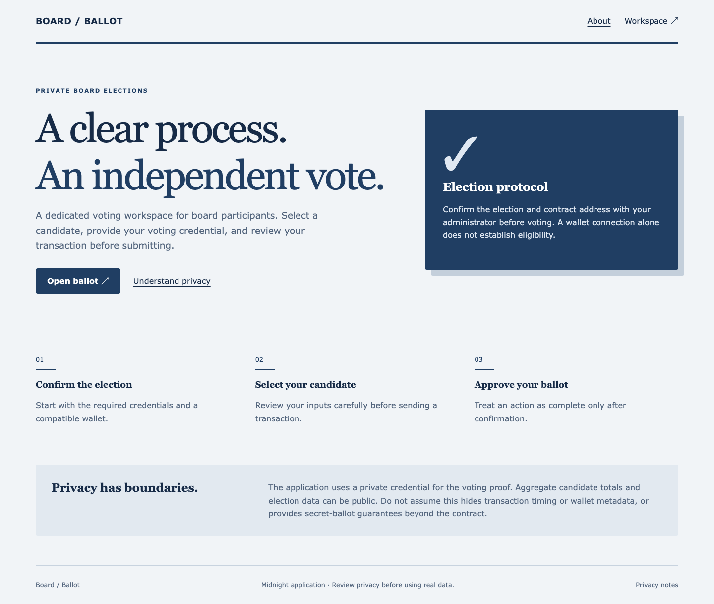
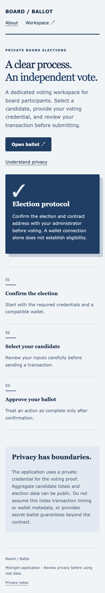
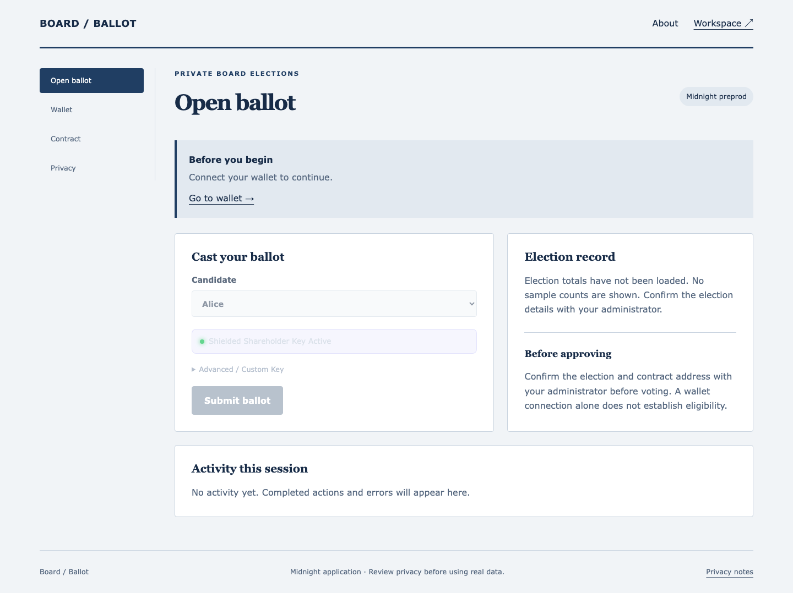
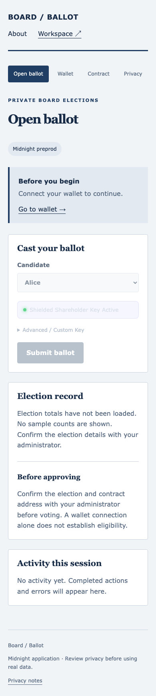
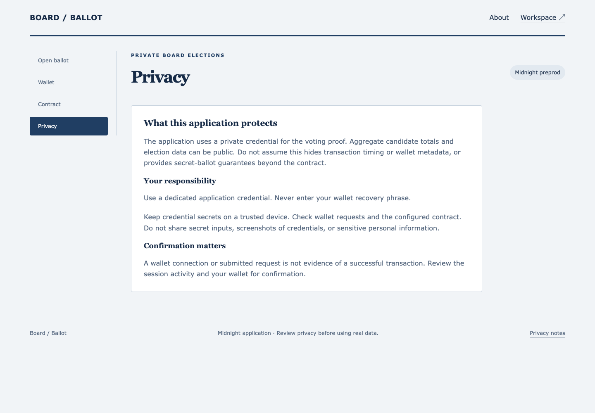
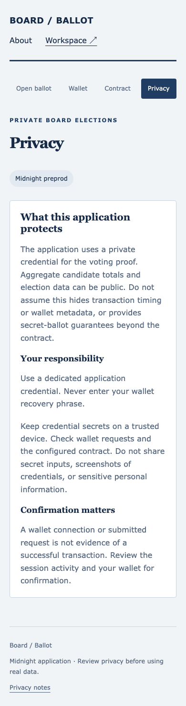
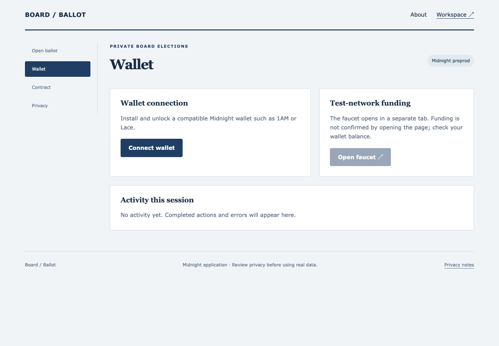
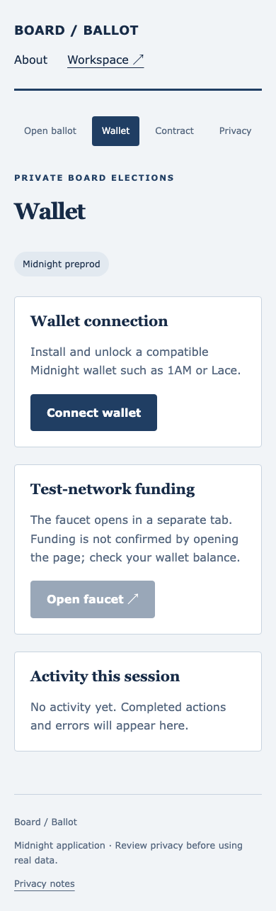
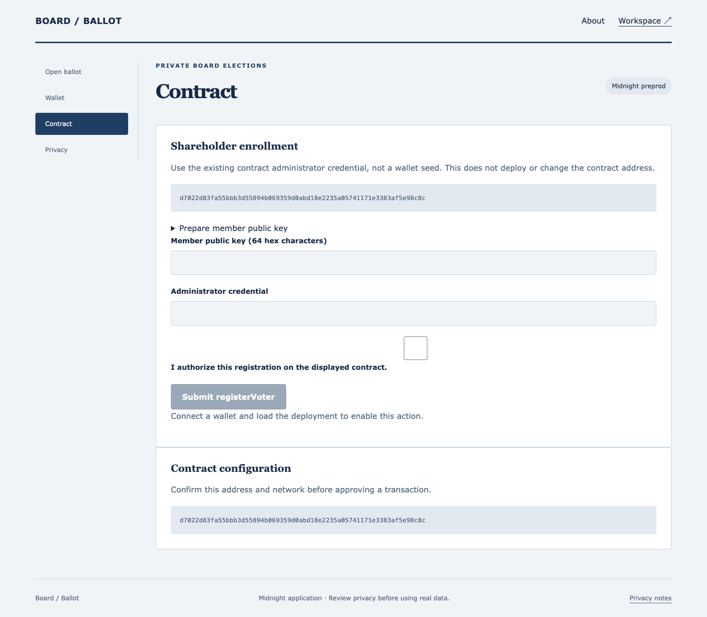
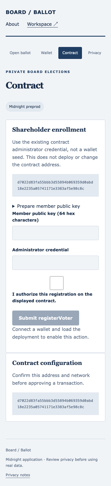

# Boardroom Console: Confidential Corporate Governance 🏛️


## Level 4 release evidence — review pending

[Open the hosted application](https://board-election.vercel.app) · [Setup](SETUP.md) · [Usage](USAGE.md) · [Proposal](PROPOSAL.md) · [Tests](TESTING.md)

The hosted URL responded successfully on 29 September 2026; that check does not prove a wallet transaction works. The recorded contract coordinates are in [deployment.json](deployment.json). Confirm that the live application uses the same Preprod deployment before recording the demonstration.

- Local tests and production build passed. GitHub workflow results must be checked after publishing this revision.
- Desktop and mobile captures below cover every page. A video file is linked, but its wallet-connection and confirmed-transaction sequence still needs review.
- **Outstanding: public product X profile URL.** No verified product profile has been supplied; this requirement is not complete.
- Commit history exceeds 15 entries. Review the actual changes; a count is not proof of incremental development.

[Official Rise In program requirements](https://www.risein.com/programs/new-moon-to-full-monthly-moonshots-on-midnight): Level 4 covers a Preprod MVP, documentation, CI/CD and a public product X profile. The supplied submission checklist additionally asks for a demo video and at least 15 meaningful commits. Automated test calls must not be presented as independent users.


## Desktop and mobile walkthrough

Fresh captures of this build at 1440 × 1000 and 390 × 844. Wallet disconnected; no credentials entered. These images document the interface, not transaction finality.

<details>
<summary>View every page at both screen sizes</summary>

| Page | Desktop | Mobile |
| --- | --- | --- |
| home |  |  |
| dashboard |  |  |
| privacy |  |  |
| walletHub |  |  |
| deployer |  |  |

</details>

Capture details: [manifest](screenshots/capture-manifest.json). Recorded walkthrough: [demo video](demo.webm).
### Rise In — Midnight Journey to Mastery (Level 4 Capstone Submission)

[](https://midnight.network)
[](https://docs.midnight.network)
[](https://risein.com)
[](https://github.com/omozi01/confidential-corporate-governance/actions/workflows/frontend-ci.yml)
[](https://github.com/omozi01/confidential-corporate-governance/actions/workflows/contract-ci.yml)

**Boardroom Console** is a confidential executive voting and director election terminal built on the **Midnight Network**. Designed for enterprise boards of directors and institutional committees, it ensures that boardroom votes remain strictly confidential while providing verifiable mathematical tallies and irreversible election settlement.

---

## 🎬 Product Demo Video

- 🌐 **Watch Online:** [Stream on Google Drive ↗](https://drive.google.com/file/d/1tUmh5BuoCrX1R5ozWo42vJ1Ke858IbR1/view?usp=sharing)
- 📁 **Local Video File:** [`demo.webm`](./demo.webm)

<video src="./demo.webm" controls="controls" width="100%"></video>

---

## 📋 Rise In Level 4 Capstone Submission Evidence

| Requirement | Evidence / Implementation Details |
| :--- | :--- |
| **Public Source Repository** | [omozi01/confidential-corporate-governance](https://github.com/omozi01/confidential-corporate-governance) |
| **Commit Volume** | 25+ structured commits detailing boardroom circuits and executive console |
| **Compact Smart Contract** | `contracts/board_voting.compact` compiled with Compact 0.30.0 |
| **Automated Verification** | Full test suite in `src/test/board_voting.test.ts` checking director voting and nullifiers |
| **Web DApp Frontend** | Executive boardroom console built with React, TypeScript, and Vite |
| **Instant Visitor Access** | Midnight Lace wallet integration with automated director key derivation |
| **Preprod Deployment** | Confirmed on Midnight Preprod (`d7022d83fa55...8c8c`) |
| **Demo Walkthrough** | Video demonstrating director registration, ballot submission, and tally closure |
| **Documentation Dossier** | Complete [PROPOSAL.md](PROPOSAL.md), [TESTING.md](TESTING.md), [SECURITY.md](SECURITY.md), and [OPERATIONS.md](OPERATIONS.md) |

---

## 🌟 Executive Summary & Problem Solved

### The Problem
Corporate governance votes (CEO appointments, executive compensation, M&A authorizations) cannot be held on public blockchains:
1. **Boardroom Politics & Hostility:** If individual board members' votes are visible, voting against a powerful founder or activist investor creates toxic politics and retaliation.
2. **Inside Information Leaks:** Unsealed votes reveal impending mergers or leadership changes before public SEC disclosure.
3. **Paper & Portal Vulnerabilities:** Centralized board portals are vulnerable to administrator tampering and unauthorized access.

### The Midnight Solution
Boardroom Console leverages Midnight’s zero-knowledge cryptography:
- Directors cast votes anonymously using client-side zero-knowledge proofs.
- Cryptographic nullifiers guarantee each director votes exactly once.
- The contract updates the aggregate tally without revealing how any specific board member voted.

---

## 🔒 Zero-Knowledge Architecture & Privacy Model

```
       [Board Member Laptop]
                 │
  (Private Director SK + Candidate Choice)
                 │
                 ▼
       [Compact ZK Prover]
                 │
   Proves: Director is in Board Roster
   Generates Nullifier = hash(Director_SK, Election_ID)
                 │
                 ▼
    [Midnight Preprod Blockchain]
                 │
   1. Verifies Proof & Rejects Double-Voting
   2. Increments Candidate Tally Anonymously
```

- **Private Witness:** Director secret key (`sk`), candidate selection, and vote salt.
- **Public Ledger State:** Election ID, candidate vote counts, total board ballots cast, and election status.
- **Circuit Guarantee:** Zero identity leakage; no observer can determine whether Director A voted for Candidate X or Y.

---

## 📜 Smart Contract Surface (`contracts/board_voting.compact`)

Key exported circuits:
- `registerDirector(director_pk)`: Administrator registers credentialed board members.
- `castVote(candidate_id)`: Enforces director eligibility, updates candidate counts, and records nullifier.
- `closeElection()`: Concludes voting and seals the final corporate resolution.

---

## 🚀 On-Chain Deployment Coordinates

| Field | Preprod Verification Record |
| :--- | :--- |
| **Network** | Midnight Preprod |
| **Contract Name** | `board_voting` |
| **Contract Address** | `d7022d83fa55bbb3d55894b069359d0abd18e2235a05741171e3383af5e98c8c` |
| **Deployment Transaction** | `92ec40f2da4b068fd4b863e44b14844e6edbd4a3f7b23f1288e87a2ddc7514e3` |
| **Election ID** | `626f6172642d656c656374696f6e2d3100000000000000000000000000000000` |
| **Confirmation Status** | Confirmed by Midnight Preprod Indexer |

---

## 💻 Local Setup & Reproduction Guide

### Prerequisites
- Node.js 20.x or 22.x
- npm 10.x
- Compact compiler 0.30.0

```bash
# Install dependencies
npm install

# Compile zero-knowledge circuits
npm run compile

# Run tests
npm test

# Build production bundle
npm run build

# Launch development server
npm run dev
```

---

## 📁 Repository Structure

- `contracts/board_voting.compact`: Compact ZK contract governing director ballots and tallies.
- `src/App.tsx`: Executive boardroom dashboard, candidate voting UI, and board administrator desk.
- `src/midnightClient.ts`: Midnight Lace wallet integration and transaction flow.
- `src/test/board_voting.test.ts`: Automated tests covering voting, nullifiers, and election closure.
- `PROPOSAL.md`, `TESTING.md`, `SECURITY.md`, `OPERATIONS.md`: Comprehensive documentation.
